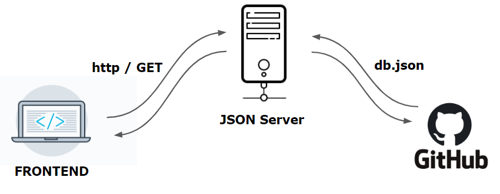

# Blog4Engineer
  

This project was generated with [Angular CLI](https://github.com/angular/angular-cli) version 9.0.6.

### About Blog4Engineer
An open-source blog for easily sharing your knowledges, personal achievements, experiences and archived POCs :man_technologist:

 :white_check_mark: **TO BEGIN**

This guide explains the prerequisites for setting up the Blog4Engineer application, a personal blog, on your own platform. This requires some technical knowledge, however the first version [branch-1](https://github.com/kasdihacene/BlogCreator4Engineer/tree/version-1) of the application doesn't require to be an expert to deploy it in production and to obtain your own domain name.

:large_blue_diamond: Version 1

* Retrives you resume from the remote server (JSON Server)
* Highlights your github activity
* Retrieves Articles, realized POCs an published Posts.

### :construction_worker: What was it built with? 

:large_blue_diamond: **TECH STACK**

        Angular 9
        Bootstrap 4
        JSON Server (https://my-json-server.typicode.com/)

CI/CD

        - Github Actions for deploying
        - Travis for the Build job and code coverage
        - codecov.io to get report of tests

:heavy_check_mark: The features are implemented using **TDD Test-Driven Development with Outside-In and Inside-Out approaches**. 

### Blog4Engineer Architecture V1

The target data are stored on Github as json file **[db.json]**, A Typicode JSON Server intercepts the request and retrieves the data according to the requested object.

### :rocket: What do I need to set it up?

:wrench: **Prerequisite :**

        You have to install :
        - A run-time environment node.js
        - Node Package Manager npm 
        - Angular CLI (npm install -g @angular/cli).
        

You'll need some basic experience with the command line, and access to your own JSON server where you can retrieve the data. And some node.js dependencies to install. 

> For the first time, you have to install Install the dependencies in the local node_modules folder. 

        > git clone <REPOSITORY>
        > cd <REPOSITORY> 
        > npm install
        > ng serve [OPTION]

        ## [OPTION] : by default the development mode will be fired else --prod to get the configuration set for production

## Development server

Run `ng serve` for a dev server. Navigate to `http://localhost:4200/`. The app will automatically reload if you change any of the source files.

## Code scaffolding

Run `ng generate component component-name` to generate a new component. You can also use `ng generate directive|pipe|service|class|guard|interface|enum|module`.

## Build

Run `ng build` to build the project. The build artifacts will be stored in the `production/` directory. Use the `--prod` flag for a production build.

                ng build --prod --output-path production

## Running unit tests

Run `ng test` to execute the unit tests via [Karma](https://karma-runner.github.io).

## Running end-to-end tests

Run `ng e2e` to execute the end-to-end tests via [Protractor](http://www.protractortest.org/).

## Further help

To get more help on the Angular CLI use `ng help` or go check out the [Angular CLI README](https://github.com/angular/angular-cli/blob/master/README.md).
